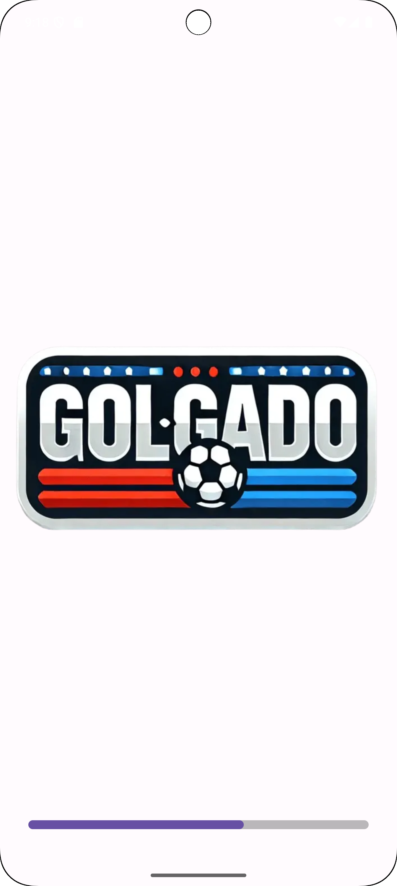
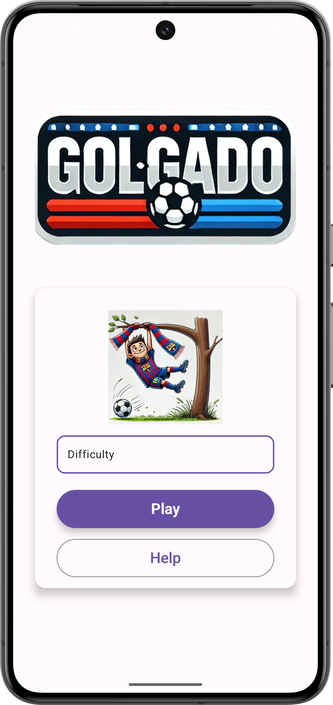
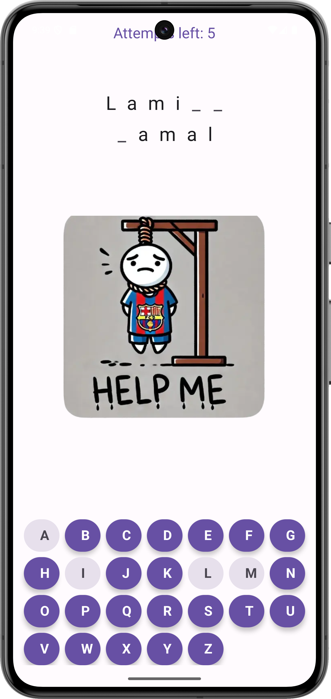
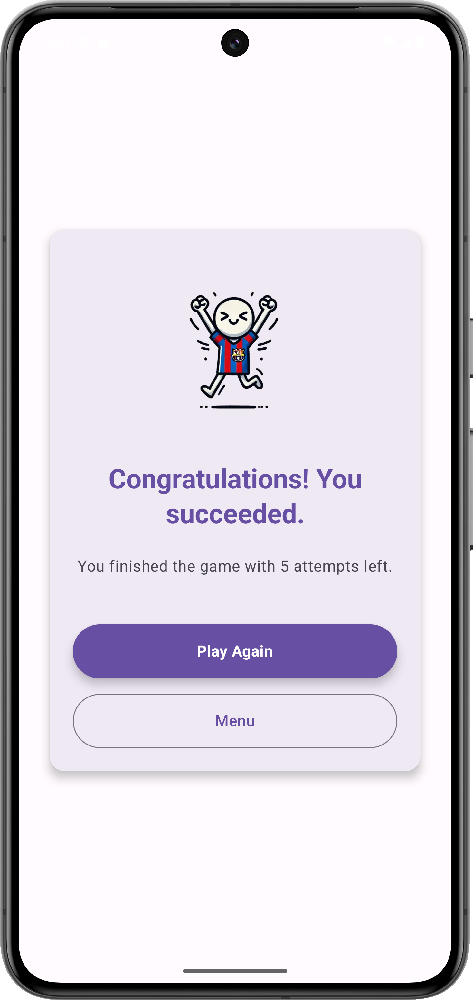
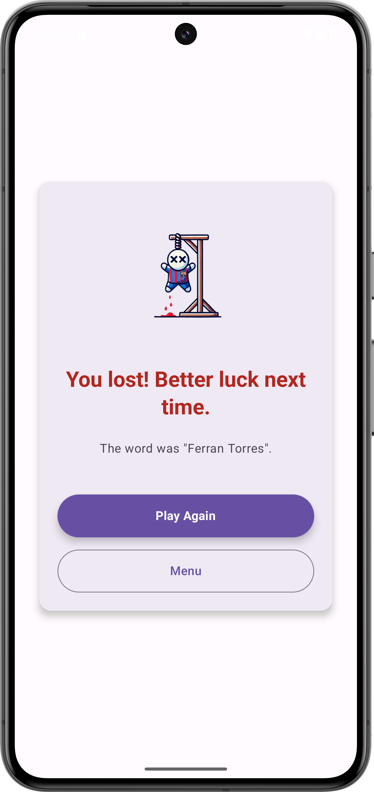

# GOLGADO - Hangman de Nombres de Futbolistas

GOLGADO es una aplicación móvil que adapta el clásico juego del Ahorcado para los aficionados al fútbol. En esta versión, los jugadores deben adivinar nombres de futbolistas famosos seleccionando letras del alfabeto.  
El objetivo es acertar el nombre antes de que se agoten los intentos. La dificultad varía según la longitud de los nombres y el número de intentos, permitiendo a los usuarios elegir entre tres niveles: **Fácil**, **Medio** y **Difícil**.  
Con una interfaz atractiva diseñada en Jetpack Compose, la app está pensada para ser entretenida, intuitiva y desafiante, combinando el amor por el fútbol con la diversión de los juegos clásicos.

## Funcionalidades principales

- **Pantalla de carga interactiva:**
  - Una pantalla inicial que muestra el logotipo del juego junto con una barra de progreso animada.
  - Proporciona una experiencia visual agradable mientras se prepara la app.

- **Menú principal:**
  - Permite a los usuarios seleccionar el nivel de dificultad: **Fácil**, **Medio** o **Difícil**.
  - Ofrece botones para iniciar una partida y consultar las instrucciones del juego.

- **Pantalla del juego:**
  - Visualización interactiva del ahorcado y de la palabra oculta.
  - **Teclado virtual dinámico:**
    - Las letras seleccionadas se desactivan automáticamente.
  - Indicador del número de intentos restantes.
  - Imagen del ahorcado.

- **Pantalla de resultados:**
  - Muestra el resultado de la partida:
    - **Mensaje de victoria:** Te felicita por ganar y te dice el número total de intentos que has necesitado. Además de un botón para volver a jugar y otro para ir al menú.
    - **Mensaje de derrota:** Si el jugador pierde, se le revela cuál era la palabra correcta. Además de un botón para volver a jugar y otro para ir al menú.

- **Opciones de dificultad:**
  - **Fácil:** Nombres cortos y conocidos como "Messi" o "Xavi".
  - **Medio:** Nombres de longitud media como "Mbappe" o "Griezmann".
  - **Difícil:** Nombres largos compuestos por dos palabras como "Zlatan Ibrahimovic" o "Lamine Yamal".

## Modelo de Datos

La aplicación sigue el patrón de diseño **MVVM (Model-View-ViewModel)**, lo que garantiza una separación clara entre la lógica del negocio, la interfaz de usuario y los datos. Esto facilita la escalabilidad y el mantenimiento del proyecto.

### Componentes principales

1. **ViewModel:**
   - Gestiona la lógica del juego y expone los datos necesarios para las vistas a través de `LiveData`.
   - Ejemplo: `GameScreenViewModel`:
     - Controla las palabras a adivinar basándose en el nivel de dificultad seleccionado.
     - Gestiona los intentos restantes, las letras adivinadas y el estado del juego (ganado o perdido).
     - Almacena las listas de nombres de futbolistas según el nivel de dificultad (`Easy`, `Medium`, `Hard`).

2. **View:**
   - Compuesta por pantallas desarrolladas en Jetpack Compose, que incluyen:
     - **GameScreen:** La pantalla principal del juego, que muestra la palabra oculta, el teclado interactivo y los intentos restantes.
     - **MenuScreen:** Permite seleccionar el nivel de dificultad y navegar al juego.
     - **ResultScreen:** Presenta el resultado (victoria o derrota) y ofrece opciones para jugar nuevamente o regresar al menú.

### Navegación entre Pantallas

La app utiliza Navegación Declarativa de Jetpack Compose para gestionar las transiciones entre pantallas de manera eficiente. Esto se realiza a través de un `NavHost` y rutas definidas en `Routes`.

### Pantallas principales

1. **Pantalla de Inicio (LaunchScreen):**
   - Presenta un logotipo con una barra de progreso animada antes de redirigir al menú principal.

2. **Menú Principal (MenuScreen):**
   - Los usuarios seleccionan el nivel de dificultad y pueden iniciar una partida o consultar las instrucciones.

3. **Juego (GameScreen):**
   - Muestra la palabra oculta, un teclado interactivo y el estado del ahorcado.

4. **Resultados (ResultScreen):**
   - Muestra si el usuario ganó o perdió, además de las opciones para volver a jugar o regresar al menú.

